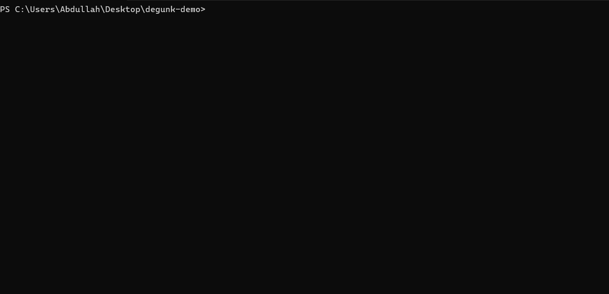

# degunk

Developers lose tens of gigabytes of disk space to old `node_modules`, `venv`, `target`, and build caches in projects they haven't touched in months. `degunk` finds those discarded folders, shows you how long it's been since you committed to each repo, and lets you reclaim disk space safely.



---

## Understanding the dashboard

When you run `degunk`, it groups build artifacts by project and surfaces safety information before you delete anything:

* **Safety status (`✓ Safe to clean`, `● Dirty worktree`, `↑ Unpushed`, `⚠ No lockfile`)**: Combines Git working tree state and dependency lockfile verification into an instant recommendation:
  * `✓ Safe to clean`: The Git repository is clean (or not tracked by Git) and a dependency lockfile is present. Build artifacts can be safely reclaimed and restored identically anytime.
  * `● Dirty worktree`: Uncommitted changes exist in the working tree. Cleaning is discouraged while active work is in flight.
  * `↑ Unpushed`: Local commits have not been pushed to the remote repository.
  * `⚠ No lockfile`: Missing lockfile (`package-lock.json`, `Cargo.lock`, `poetry.lock`, etc.). Reinstalling dependencies later could resolve newer, untested versions.
* **Git status (`✓ Clean`, `● N dirty`, `↑ N unpushed`)**: Shows the exact repository state, detailing modified file counts and commits ahead of origin.
* **Inactivity**: Measures how many days have passed since your last Git commit to that repo (for example, `Active today`, `90d ago`, `210d ago`). This helps you spot forgotten projects that are safe to clean.
* **Projects vs Global caches**: Press `Tab` to switch between project build directories (`node_modules`, `target`, `.venv`) and central developer caches (`Cargo` registries, `Go` modules, `npm` cache, Playwright browsers, and local Ollama model weights).
* **Trash vs Permanent delete**: Files move to your operating system's Recycle Bin or Trash by default, so you can restore anything you delete by accident.

---

## Installation

### Homebrew (macOS and Linux)

```bash
brew install abdullahhassan192/tap/degunk
```

### Scoop (Windows)

```powershell
scoop bucket add degunk https://github.com/AbdullahHassan192/scoop-degunk
scoop install degunk
```

### Shell script (macOS and Linux)

```bash
curl -fsSL https://raw.githubusercontent.com/AbdullahHassan192/degunk/main/scripts/install.sh | sh
```

### PowerShell (Windows)

```powershell
irm https://raw.githubusercontent.com/AbdullahHassan192/degunk/main/scripts/install.ps1 | iex
```

### Cargo

```bash
cargo install degunk
```

### Prebuilt binaries

Precompiled standalone binaries for Windows (x86_64), macOS (Apple Silicon and Intel), and Linux (x86_64 and ARM64) are available on the [GitHub Releases](https://github.com/AbdullahHassan192/degunk/releases) page.

---

## Quick start

Run `degunk` to open the interactive path picker, or scan folders directly:

```bash
# Open the interactive path picker
degunk

# Scan the current directory immediately
degunk .

# Scan specific project folders or drives
degunk D:\projects ~/code

# Filter by ecosystem when launching
degunk . --types node,rust,python

# Filter by inactivity age (days)
degunk . --older-than 60

# Filter by minimum artifact size
degunk . --min-size 100MB
```

---

## Keyboard shortcuts

| Key | Action |
| :--- | :--- |
| `↑` / `k`, `↓` / `j` | Move selection up or down |
| `Space` | Select or deselect item (selecting a project selects all its build targets) |
| `Enter` / `e` | Expand or collapse project folder |
| `E` | Expand all or collapse all project groups |
| `Tab` | Switch between **Projects** and **Global Caches** views |
| `s` | Cycle sort order (Size, Inactivity age, Name, Ecosystem) |
| `/` | Search projects and filter by token |
| `p` | Open the path picker to scan a different drive or directory |
| `d` | Open deletion confirmation modal |
| `r` | Rescan current paths and global caches |
| `q` / `Ctrl+C` | Quit |

### Search syntax

Type `/` to search names, folder names, and paths. You can also mix in filter tokens:

* `eco:rust`, `eco:node`, `eco:python`, `eco:unreal`, `eco:android`, `eco:rn`, `eco:r`
* `size:>100m`, `size:>1g`, `size:<50m`
* `days:>60`, `age:>30`
* `safe:yes`, `safe:no`
* `locked:yes`, `locked:no`
* `git:clean`, `git:dirty`

Example: `/eco:python size:>100m days:>60 git:clean`

---

## Supported ecosystems and targets

<details>
<summary><b>View all 28 supported ecosystems and artifact directories</b></summary>

| Ecosystem | Target folders | Key markers | Lockfile |
| :--- | :--- | :--- | :--- |
| **Node.js / Modern Web** | `node_modules`, `.next`, `.nuxt`, `.turbo`, `.svelte-kit`, `.angular`, `.astro`, `.parcel-cache`, `.vite`, `.output`, `.swc`, `.nitro`, `.wrangler`, `.vercel`, `.netlify`, `.sst`, `.cache`, `storybook-static` | `package.json`, `wrangler.toml`, `vercel.json`, `nitro.config.*`, etc. | `package-lock.json`, `pnpm-lock.yaml`, `yarn.lock`, `bun.lockb` |
| **Python** | `.venv`, `venv`, `env`, `__pycache__`, `.pytest_cache`, `.mypy_cache`, `.ruff_cache`, `dist`, `build`, `*.egg-info`, `.tox`, `.nox`, `.pixi`, `.ipynb_checkpoints` | `pyproject.toml`, `requirements.txt`, `Pipfile`, `setup.py` | `poetry.lock`, `Pipfile.lock`, `uv.lock`, `pdm.lock` |
| **Rust** | `target` | `Cargo.toml` | `Cargo.lock` |
| **Java / Kotlin** | `build`, `.gradle`, `target` | `build.gradle`, `build.gradle.kts`, `pom.xml` | `gradle.lockfile` |
| **Android / NDK** | `.cxx`, `.externalNativeBuild`, `build` | `build.gradle`, `build.gradle.kts`, `CMakeLists.txt`, `settings.gradle` | `gradle.lockfile` |
| **React Native / Expo** | `.expo`, `.metro-health-check`, `ios/build`, `android/app/build` | `app.json`, `package.json`, `metro.config.js`, `expo-env.d.ts` | `package-lock.json`, `pnpm-lock.yaml`, `yarn.lock`, `bun.lockb` |
| **Go** | `vendor` | `go.mod` | `go.sum` |
| **.NET / C#** | `bin`, `obj`, `BenchmarkDotNet.Artifacts`, `TestResults` | `*.csproj`, `*.fsproj`, `*.sln` | `packages.lock.json` |
| **C / C++** | `build`, `CMakeFiles`, `cmake-build-*`, `builddir`, `.vs`, `vcpkg_installed` | `CMakeLists.txt`, `Makefile`, `meson.build`, `vcpkg.json`, `*.sln` | `vcpkg-lock.json` |
| **Unreal Engine** | `Intermediate`, `Saved`, `DerivedDataCache`, `Binaries` | `*.uproject`, `*.uplugin` | N/A |
| **Embedded / PlatformIO** | `.pio` | `platformio.ini` | N/A |
| **iOS / Swift** | `.build`, `DerivedData`, `Pods`, `Carthage` | `Package.swift`, `Podfile`, `Cartfile`, `*.xcodeproj`, `*.xcworkspace` | `Package.resolved`, `Podfile.lock`, `Cartfile.resolved` |
| **Flutter / Dart** | `.dart_tool`, `build` | `pubspec.yaml` | `pubspec.lock` |
| **PHP** | `vendor` | `composer.json` | `composer.lock` |
| **Elixir** | `_build`, `deps` | `mix.exs` | `mix.lock` |
| **Zig** | `zig-cache`, `zig-out` | `build.zig`, `build.zig.zon` | `build.zig.zon` |
| **Godot** | `.godot` | `project.godot` | N/A |
| **Unity** | `Library`, `Temp`, `Obj` | `ProjectSettings` | N/A |
| **Ruby** | `.bundle`, `vendor` | `Gemfile` | `Gemfile.lock` |
| **Scala** | `target`, `.bloop`, `.metals` | `build.sbt` | N/A |
| **Haskell** | `.stack-work`, `dist-newstyle` | `stack.yaml`, `*.cabal`, `cabal.project` | `stack.yaml.lock`, `cabal.project.freeze` |
| **OCaml** | `_build` | `dune-project`, `dune` | `dune.lock` |
| **R** | `.Rproj.user`, `.Rcache`, `renv/library` | `*.Rproj`, `renv.lock`, `DESCRIPTION` | `renv.lock` |
| **Elm** | `elm-stuff` | `elm.json` | N/A |
| **Clojure** | `.cpcache`, `.shadow-cljs`, `.calva` | `project.clj`, `deps.edn`, `shadow-cljs.edn` | N/A |
| **Julia** | `.julia` | `Project.toml`, `JuliaProject.toml` | `Manifest.toml` |
| **Terraform / IaC** | `.terraform`, `.serverless`, `.aws-sam` | `*.tf`, `*.tofu`, `serverless.yml`, `samconfig.toml` | `.terraform.lock.hcl` |
| **Coverage & Tests** | `coverage`, `.nyc_output`, `htmlcov`, `test-results`, `playwright-report`, `.playwright` | Project test runners & configs | N/A |

</details>

---

## Global tool caches

Press `Tab` in the TUI to inspect central tool caches that live outside your project folders:

* **Package managers & registries**: Cargo checkouts and git registries, Go module cache (`GOPATH/pkg/mod`), npm, pnpm, Yarn, pip, uv, Bun, Pub, NuGet, Ruby gems, Coursier, vcpkg binary archives and download cache, Homebrew bottles, R renv cache.
* **Compilers & build systems**: Go build cache, ccache, sccache, Rustup toolchains, Zig cache, Unreal Engine Global DDC, Gradle daemon logs and caches, Android build artifacts, Android emulator AVD images, Xcode DerivedData, CocoaPods, Terraform plugins, Docker Desktop WSL virtual disk (`ext4.vhdx`).
* **Browser binaries**: Playwright standalone browser builds (Chromium, Firefox, WebKit), Cypress desktop binary cache.
* **AI model weights**: Ollama models (`~/.ollama/models`), LM Studio, HuggingFace Hub, PyTorch Hub cache, Whisper weights.
* **Editor caches**: JetBrains system caches, VS Code workspace storage, Cursor workspace storage.

---

## Development

```bash
# Check compiler diagnostics
cargo check

# Run test suite
cargo test
```
